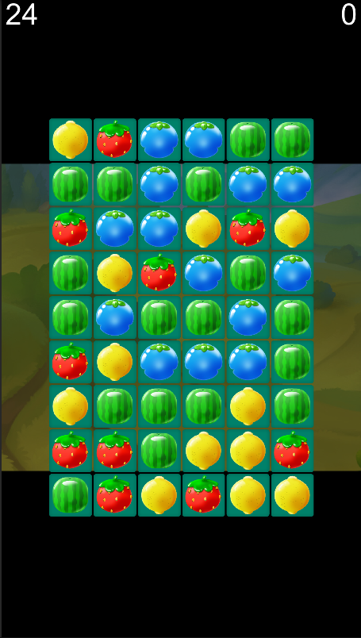

# ROW MATCH
It's a game that you align same type fruits on the same line to finish the level.

## Features

# Game Core
- Matching same type objects on the same line to gain score and get a higher star count on the level ending.
- Complete at least one line before you are out of steps to complete level.

# Level Updating System
You can design new levels by creating a txt file. The game can download this txt file from given url and add new levels to the game.

# GUI System
Using own GUI system, not Unity's default Canvas.

